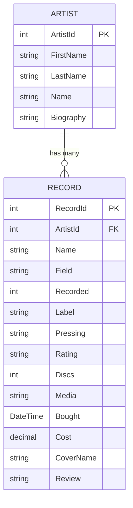

# RecordDB.Core

[](https://dotnet.microsoft.com/)
[](https://github.com/DapperLib/Dapper)
[](https://www.microsoft.com/sql-server)
[](https://learn.microsoft.com/aspnet/core/razor-pages/)

**RecordDB.Core** is a modern .NET 10 web application and data access library designed for organizing, searching, tracking, and analyzing a personal music record and CD collection. It features comprehensive management for artists, record releases, purchase expenditures, reviews, and detailed collection statistics.

---

## 🌟 Features

- **Artist Directory**: Create, update, view, and search artist profiles, complete with biography tracking and artist discography views.
- **Record & Album Management**: Track release details including title, genre/field (Rock, Folk, Acoustic, Jazz, Blues, Country, Classical, Soundtrack), release year, media format (CD, Vinyl, etc.), disc count, pressing details, record label, purchase date, purchase price, rating (1–4 stars), cover imagery, and review text.
- **Collection Analytics & Statistics**: Visual breakdowns of collection totals, genre distributions, rating breakdowns, annual acquisition statistics (discs added, total spending, average cost per disc for 2017–2022+), and artist-level expenditure analysis.
- **Review & Audit Tools**: Identify records missing review notes, view album reviews, and filter records by release year or artist.
- **Structured Logging**: Integrated [Serilog](https://serilog.net/) logging writing structured events to the console and daily rolling log files (`Logs/recorddb-.log`).

---

## 🏗 Solution Architecture

The solution uses a clean 3-tier architecture built with .NET 10:

```
RecordDB.Core (Solution)
├── RecordDB.Core/          ASP.NET Core Razor Pages Web Application (Presentation Layer)
├── RecordDB.DAL/           Data Access Layer Library (Dapper, Models, Repositories, DTOs)
└── RecordDB.Test/          Console App for Integration Testing & Repository Diagnostics
```

### 1. Presentation Layer — [`RecordDB.Core`](RecordDB.Core/)
An **ASP.NET Core Razor Pages** application providing an intuitive web interface for collection management.
- **`Pages/Artists/`**: Razor pages for listing, viewing, searching, creating, editing, and deleting artists.
- **`Pages/Records/`**: Pages for managing album entries, viewing disc counts, missing reviews, annual acquisition reports, and total cost summaries.
- **`Pages/Statistics/`**: Summary dashboard presenting collection metrics and spending history.
- **`wwwroot/`**: Static CSS, JS, and media assets.

### 2. Data Access Layer — [`RecordDB.DAL`](RecordDB.DAL/)
A C# class library encapsulating all database interactions with **SQL Server** via **Dapper** and stored procedures.
- **`Data/`**: `IDataAccess` interface and `DataAccess` wrapper for executing parameterized stored procedures, multi-mapping queries, and scalar lookups.
- **`Repositories/`**:
  - `ArtistRepository` / `IArtistRepository` — Artist CRUD operations and biography queries.
  - `RecordRepository` / `IRecordRepository` — Album queries, disc counts, review filtering, and annual statistics.
  - `StatisticRepository` / `IStatisticRepository` — High-level collection analytics queries.
  - `TotalRepository` / `ITotalRepository` — Total cost and disc count aggregations per artist.
- **`Models/`**: `Artist`, `Record`, `Statistic`, `Total` data models with EF-style attribute annotations.
- **`DTOs/`**: Strongly-typed data transfer objects (`ArtistRecordDto`, `RecordReviewDto`, `MissingReviewDto`).
- **`Extensions/`**: Utility extension methods (`DateTimeExtensions`).

### 3. Testing Harness — [`RecordDB.Test`](RecordDB.Test/)
A .NET 10 console application for running diagnostics, repository integration tests, and database verification scripts (`ArtistService`, `RecordService`, `StatisticService`).

---

## 🗄 Data Model & Entity Relationships

The core database model consists of a **One-to-Many** relationship between `Artist` and `Record`:



---

## 🛠 Tech Stack

- **Target Framework**: .NET 10.0 (`net10.0`)
- **Web Framework**: ASP.NET Core Razor Pages
- **ORM / Data Access**: [Dapper 2.1](https://github.com/DapperLib/Dapper) & [Dapper.Contrib 2.0](https://github.com/DapperLib/Dapper/tree/main/Dapper.Contrib)
- **Database Client**: `Microsoft.Data.SqlClient` (SQL Server)
- **Logging**: [Serilog](https://serilog.net/) (Console & File Sinks)

---

## 🚀 Getting Started

### Prerequisites
- [.NET 10 SDK](https://dotnet.microsoft.com/download) (or higher)
- [Microsoft SQL Server](https://www.microsoft.com/sql-server) database populated with the `RecordDB` schema and stored procedures.

### Configuration
Update the `RecordDb` connection string in `RecordDB.Core/appsettings.json`:

```json
{
  "ConnectionStrings": {
    "RecordDb": "Server=YOUR_SERVER;Database=RecordDB;User Id=YOUR_USER;Password=YOUR_PASSWORD;Encrypt=False;TrustServerCertificate=True;"
  }
}
```

### Running the Web Application
```bash
dotnet run --project RecordDB.Core
```
Once running, navigate to `https://localhost:7045` or `http://localhost:5245` in your browser.

### Running Integration Tests / Diagnostic Console
```bash
dotnet run --project RecordDB.Test
```

---

## 📝 License
Internal project / Personal music collection database.
